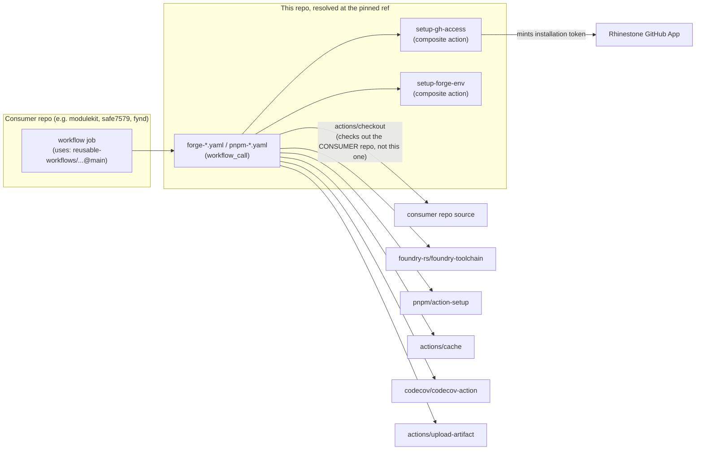

# Rhinestone Reusable Workflows

**Reusable workflows for our continuous integration suite**

Workflows:

- **Forge Lint**: Lint Solidity files
- **Forge Coverage**: Generate coverage reports
- **Forge Docs**: Generate documentation
- **Forge Build**: Build the project
- **Forge Test**: Run forge tests
- **Forge Test Simulated**: Run forge tests with ERC-4337 simulation (only applicable if using ModuleKit)

## Architecture

This repo is not a runtime service — it's shared GitHub Actions tooling. Nothing here runs continuously, holds state, or gets deployed. What ships is a git ref (almost always the `main` branch) that other Rhinestone repos' CI pin their `uses:` line to.



Key point: `actions/checkout` inside a called reusable workflow checks out the **calling** repo, not `reusable-workflows` itself. So `forge build`, `pnpm test`, etc. all run against the consumer's code — this repo supplies only the CI steps, never the build inputs. `forge-release.yaml` and `forge-artifacts.yaml` take this further: they `run:` scripts (`./build-artifacts.sh`, `./shell/prepare-artifacts.sh`) that must exist in the **consumer's** repo — nothing in `reusable-workflows` provides them. `release.sh` at the root of *this* repo is a leftover/reference script (same forge-build-and-verify shape as `build-artifacts.sh`) — it isn't invoked by any workflow here.

### What calls this

Consumer repos reference these workflows/actions via `uses: rhinestonewtf/reusable-workflows/.github/workflows/<file>@main` in their own `.github/workflows/*.yaml`. Found via `gh search code "reusable-workflows" --owner rhinestonewtf` plus a local-checkout grep (the search misses at least some private repos — `eco-arbiter`, `relay-arbiter`, `relay-arbiter-v2` are private and only turned up locally, so treat this as a lower bound):

| Consumer | Workflows used |
|---|---|
| `account-locker`, `across-arbiter`, `axiom-keystore-modules`, `checknsignatures`, `compact-locker`, `compact-utils`, `core-modules`, `demo-spokepool`, `ens-modules`, `env-setup`, `erc4337-validation`, `experimental-modules`, `femplate`, `flatbytes`, `module-bases`, `modulekit`, `module-template`, `sentinellist`, `smart-sessions-v2` | `forge-lint.yaml`, `forge-build.yaml` |
| `eco-arbiter`, `relay-arbiter`, `relay-arbiter-v2` (private, local-only) | `forge-lint.yaml`, `forge-build.yaml`, `forge-test.yaml`, `forge-test-simulate.yaml`, `forge-test-multi-account.yaml` |
| `registry` | `forge-lint.yaml`, `forge-build.yaml`, `forge-docs.yaml` |
| `safe7579` | `forge-lint.yaml`, `forge-build.yaml` — pinned to a branch (`@chore/foundry-toolchain`), not `@main` |
| `orchestrator-sdk`, `automations-sdk` | `pnpm-build.yaml`, `pnpm-size.yaml` |
| `fynd` | `setup-gh-access` action directly (several workflows) |

`forge-coverage.yaml`, `forge-release.yaml`, `forge-artifacts.yaml`, and `pnpm-test.yaml` have **no known consumer** in the repos above — they may be used by a private repo this search didn't surface, or be unused/vestigial. Verify before changing them; don't assume they're dead.

Every consumer found pins `@main` (a mutable branch), not a tag or SHA — including this repo's own workflows, which call `rhinestonewtf/reusable-workflows/.github/actions/setup-gh-access@main` on themselves. There are no git tags in this repo and `release.sh` doesn't cut one. **A merge to `main` here takes effect on every consumer's very next CI run, with no version bump, staged rollout, or way to opt out.** Treat any change to a `.github/workflows/*.yaml` or `.github/actions/*/action.yaml` file with the caution of a prod change, not a docs change.

### What this calls

Per job: `actions/checkout` (consumer repo), `foundry-rs/foundry-toolchain`, `actions/setup-node`, `pnpm/action-setup`, `actions/cache` (save/restore, keyed on `build-and-modules-${{ github.sha }}`), `codecov/codecov-action`, `actions/upload-artifact`, and (via `setup-gh-access`) `actions/create-github-app-token` to mint a short-lived installation token for the Rhinestone GitHub App, rewritten into `git config` so `pnpm install`/`forge build` can pull private Rhinestone dependencies. No AWS calls, no cloud credentials, no ECR — this repo doesn't touch infrastructure, only GitHub Actions and the App-token/dependency-fetch path.

Third-party actions in this repo's own YAML must be pinned to a full commit SHA (enforced by `lint-actions-pinning.yaml` via `pinact`); `rhinestonewtf/*` actions are explicitly exempted in `.pinact.yaml` since they're versioned by `@main` per the convention above.

### Datastore

None. Stateless CI tooling — nothing here persists data between runs.

### Deploy target and environments

Nothing deploys from this repo. What "ships" is a git ref that consumer workflows' `uses:` lines point at — see the pinning note above for why that makes `@main` here roughly equivalent to auto-deploying to every consumer's CI, unversioned.

### Intent lifecycle

Not applicable. This repo has no runtime connection to the deposit/fill/claim pipeline — it only provides CI steps to repos that build/test/ship code, some of which (e.g. `modulekit`, `safe7579`) are dependencies used elsewhere in that pipeline, but this repo itself never runs alongside it.

### Why it exists

DRY: avoids every consumer repo hand-rolling the same Forge/pnpm build-lint-test-coverage-release steps. What breaks without it: every consumer's CI/CD pipeline — potentially wide, since most consumers float on `@main`. Worth knowing for context: Rhinestone's infra repo applies straight to prod on merge-to-main with no separate deploy-time approval gate, so a subtle CI bug introduced here can propagate further than it looks before anyone notices.

## Using the workflows

In your `.yaml` file, you can use the workflows like so:

```yaml
jobs:
  lint-safe7579:
    uses: "rhinestonewtf/reusable-workflows/.github/workflows/forge-lint.yaml@main"
```

Some workflows require additional inputs, which you can provide like so:

```yaml
build-safe7579:
  uses: "rhinestonewtf/reusable-workflows/.github/workflows/forge-test.yaml@main"
  with:
    match-path: "test/**/*.sol"
```
